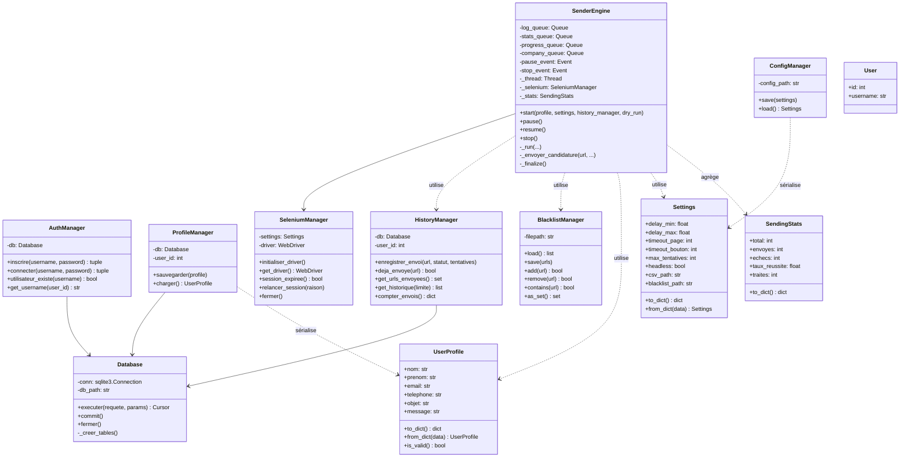

# Diagramme de classes, FT Sender

## Légende

- `→` association (composition / référence forte)
- `..>` dépendance (utilisation transitoire)

## Observations

- **Une seule instance de `Database`** est partagée par tous les managers SQL → cohérence
  transactionnelle.
- **`SenderEngine` ne dépend pas directement de la base** : il reçoit un `HistoryManager`
  injecté → testable avec un mock.
- **`Settings` et `UserProfile` sont des `@dataclass`** → typage statique, sérialisation
  automatique, valeurs par défaut explicites.
