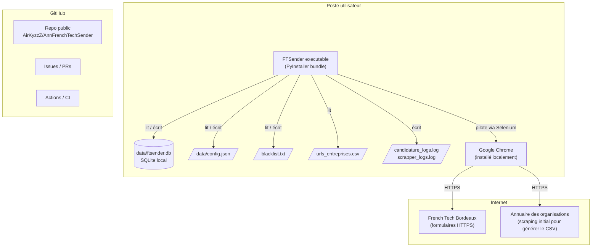

# Diagramme de déploiement — FT Sender

## Cibles supportées

| OS | État | Notes |
|---|---|---|
| macOS (Intel + Apple Silicon) | Plateforme principale de développement | `.app` produit par PyInstaller |
| Linux (Ubuntu/Debian/Fedora) | Compatible | `chmod +x` puis exécution directe |
| Windows 10/11 | Compatible | `.exe` produit par PyInstaller |

## Pré-requis utilisateur

1. **Google Chrome** installé localement (la version exacte importe peu : WebDriver Manager
   télécharge automatiquement le driver compatible).
2. **Connexion internet** (pour Selenium et le scraping initial).
3. **Aucun compte cloud** — tout reste local.

## Bundle PyInstaller

`build.spec` configure :
- inclusion des modules CustomTkinter, Selenium, bcrypt
- inclusion des ressources (icônes, fichiers texte par défaut)
- mode `--onefile` pour un binaire unique

## Versionnage des données

Les fichiers utilisateur (`data/`, `blacklist.txt`, `*.log`) sont **listés dans `.gitignore`**
et ne sont jamais commités. Seul le code et la documentation sont versionnés.
