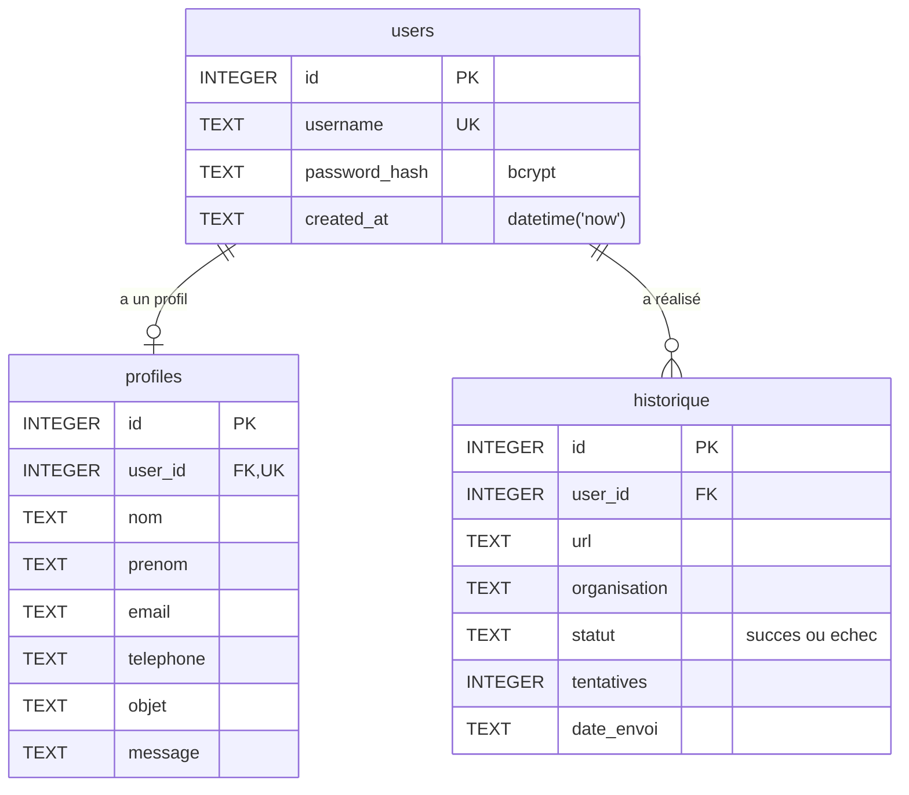

# Modèle conceptuel de données — FT Sender

## Schéma relationnel SQLite



## Cardinalités

| Relation | Cardinalité | Justification |
|---|---|---|
| `users` → `profiles` | 1 — 0..1 | Un utilisateur peut avoir au plus un profil (`UNIQUE(user_id)`). Évolutif vers 1 — N si on ajoute des profils multiples plus tard. |
| `users` → `historique` | 1 — N | Un utilisateur peut envoyer N candidatures. |

## Contraintes d'intégrité

- `users.username` est `UNIQUE` → pas de doublon.
- `profiles.user_id` est `UNIQUE` ET clé étrangère → un profil par utilisateur.
- `historique.user_id` est clé étrangère → suppression d'un utilisateur invalide les
  historiques (en pratique, on ne supprime pas les utilisateurs ; on désactive logiquement
  si besoin).
- `PRAGMA foreign_keys = ON` est activé à chaque ouverture de connexion (SQLite désactive
  les FK par défaut pour la rétrocompatibilité).

## Stockages NoSQL associés

```
data/config.json     → Settings sérialisé en JSON (NoSQL document)
blacklist.txt        → Liste plate d'URLs (NoSQL clé-valeur de fait)
```

### Pourquoi mixer SQL et NoSQL ?

| Données | Pourquoi SQL | Pourquoi NoSQL |
|---|---|---|
| Utilisateurs, profils, historique | Relations + agrégations + transactions | — |
| Configuration | — | Pas de relations, lisible humainement, pas besoin de SQL |
| Liste noire | — | Liste plate, simple à versionner / partager / éditer manuellement |

Cette **hybridation justifiée** illustre directement l'indicateur Annexe VII-5-B :
*« Le choix du type de base de données est pertinent. »*

## Migration depuis l'ancienne architecture

Avant l'introduction de l'authentification, les profils étaient stockés en JSON par
utilisateur dans `data/profiles/`. La migration vers SQLite a apporté :

- **Authentification cohérente** (mot de passe haché lié à l'utilisateur).
- **Jointures avec l'historique** (statistiques par utilisateur).
- **Transactions** garantissant que profil + historique restent cohérents.
- **Contraintes** d'unicité empêchant les doublons.

Le dossier `data/profiles/` est conservé dans `.gitignore` mais a été abandonné côté code.
