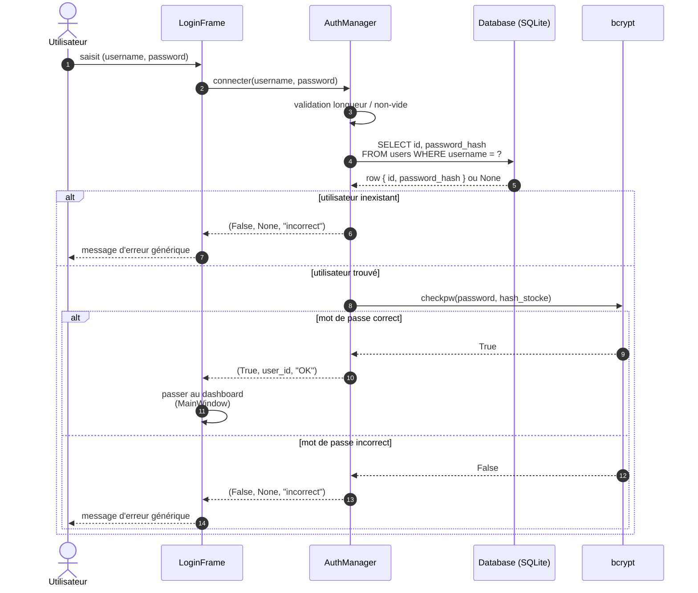

# Diagramme de séquence — Authentification (login)

## Notes de sécurité

- **Étape 4** : la requête utilise un paramètre préparé (`?`), pas de concaténation.
- **Étape 6** : `bcrypt.checkpw()` est en temps constant (résiste aux attaques par chronométrage).
- **Message d'erreur** : volontairement identique pour « utilisateur inexistant » et
  « mot de passe incorrect » → empêche l'énumération de comptes.
- **Aucun mot de passe en clair** ne transite ni dans les logs ni en base.
