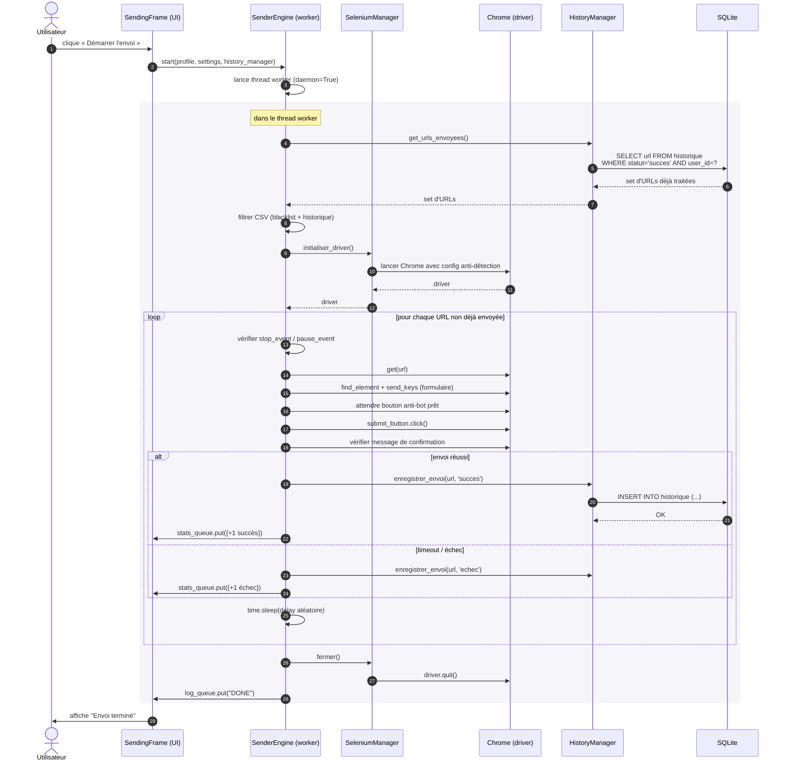

# Diagramme de séquence — Envoi automatisé d'une candidature

## Notes

- **Étape 9** : les URLs déjà envoyées avec succès sont **filtrées en amont** — preuve de la
  déduplication (compétence « Gérer les données »).
- **Étapes 11-12** : la configuration anti-détection est appliquée à chaque ouverture de
  driver.
- **Étapes répétées** : la boucle vérifie `stop_event` à chaque itération pour permettre un
  arrêt propre (compétence « Concevoir et développer » : robustesse).
- **Étape 30 (DONE)** : signal de fin que l'UI utilise pour réactiver le bouton « Démarrer ».
