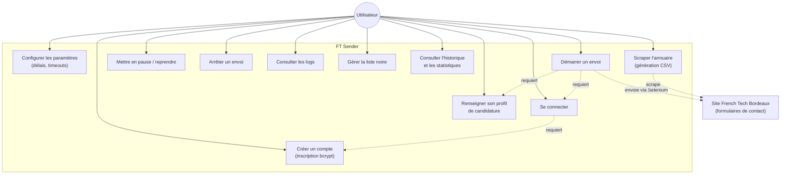

# Diagramme de cas d'utilisation, FT Sender

## Acteurs

- **Utilisateur** : un seul utilisateur authentifié à la fois (mono-utilisateur par session).
  Plusieurs utilisateurs peuvent coexister dans la base ; chacun ne voit que ses propres
  données (filtrage `WHERE user_id = ?`).
- **Site French Tech Bordeaux** (acteur secondaire) : la cible de l'automatisation
  Selenium.

## Cas d'utilisation prioritaires

1. **UC5, Démarrer un envoi** : cas central. Démarre le worker, charge les URLs, filtre par
   blacklist + historique, lance la boucle Selenium, met à jour les stats en temps réel.
2. **UC10, Consulter l'historique** : montre la valeur du choix de stockage relationnel
   (agrégations SQL).
3. **UC11, Scraper l'annuaire** : génère le fichier CSV des organisations à contacter.
